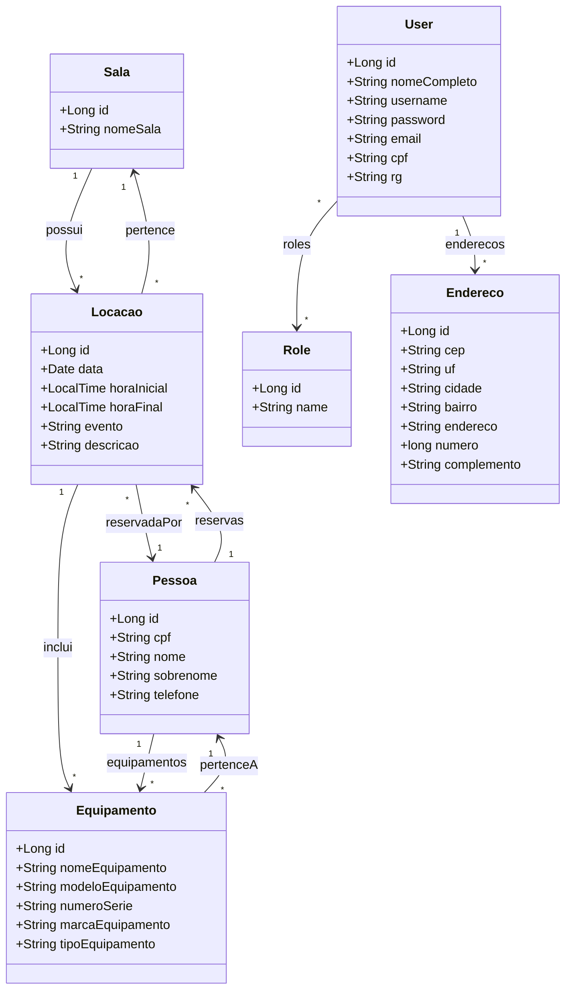

# Sistema Administrativo de Reserva de Salas e Gestão de Equipamentos

Este projeto consiste em um sistema administrativo para controle de reservas de salas e gestão de equipamentos, desenvolvido para facilitar o gerenciamento de espaços e recursos em ambientes institucionais.

## Tecnologias Utilizadas

- **Java 17+**
- **Spring Boot**
- **Spring Data JPA**
- **Hibernate**
- **Thymeleaf**
- **Lombok**
- **Banco de Dados MySQL ou PostgreSQL**
- **Maven**
- **Heroku (deploy)**

## Relação das Tabelas

- **SALA**: possui várias **LOCAÇÕES**
- **LOCAÇÃO**: pode incluir vários **EQUIPAMENTOS**
- **PESSOA**: pode reservar várias **LOCAÇÕES**
- **USER**: realiza **LOCAÇÕES** e possui **ROLES** (perfis)

Principais campos:

- SALA: id, nomeSala
- LOCACAO: id, data, horaInicial
- EQUIPAMENTO: id, nomeEquipamento, modeloEquipamento, numeroSerie, marcaEquipamento, tipoEquipamento
- PESSOA: id, cpf, nome, sobrenome
- USER: id, nomeCompleto, username
- ROLE: id, name

## Usuário e Senha Padrão

- **Usuário:** admin
- **Senha:** master123

## Como Executar o Projeto

1. Gere o JAR do projeto:
   ```sh
   mvn clean package
   ```
2. Execute o JAR gerado:
   ```sh
   java -jar target/saf-0.0.1-SNAPSHOT.jar
   ```
3. Acesse o sistema pelo navegador:
   ```
   http://localhost:8888
   ```

Se for usar Heroku, siga os passos do README para deploy.

## Diagrama das Relações de Tabelas (Mermaid)

```mermaid
erDiagram
    SALA ||--o{ LOCACAO : "possui"
    LOCACAO ||--|{ EQUIPAMENTO : "inclui"
    PESSOA ||--o{ LOCACAO : "reserva"
    USER ||--o{ LOCACAO : "realiza"
    USER ||--o{ ROLE : "possui"

    PESSOA {
        id
        cpf
        nome
        sobrenome
    }
    SALA {
        id
        nomeSala
    }
    LOCACAO {
        id
        data
        horaInicial
    }
    EQUIPAMENTO {
        id
        nomeEquipamento
        modeloEquipamento
        numeroSerie
        marcaEquipamento
        tipoEquipamento
    }
    USER {
        id
        nomeCompleto
        username
    }
    ROLE {
        id
        name
    }

```

## Diagrama das Relações das Entidades


